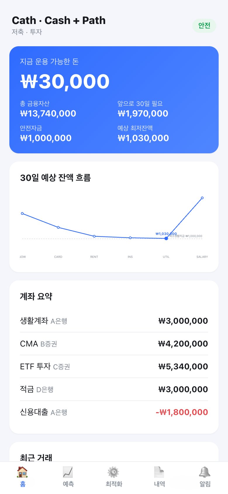
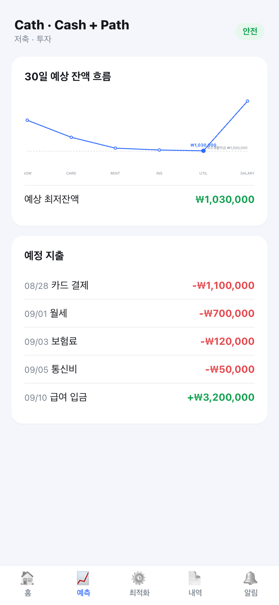
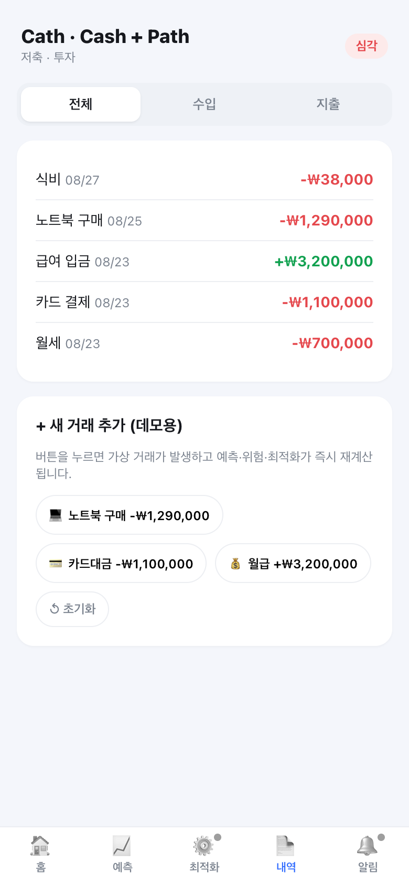
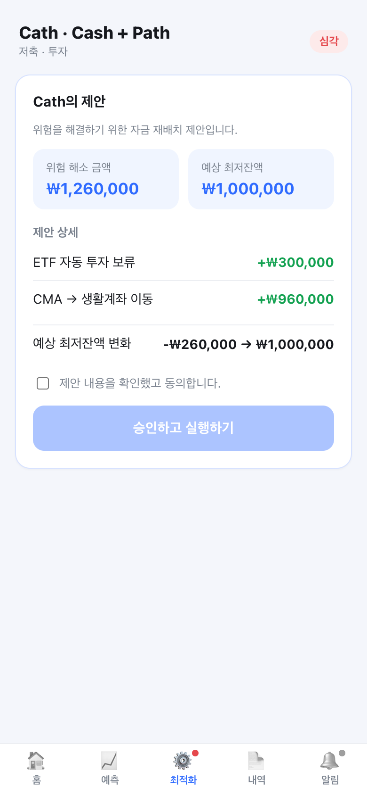

# 💧 Cath · Cash + Path

> 돈이 필요한 곳으로, 알아서 흐르도록.

여러 금융기관에 흩어진 데이터를 통합해 **미래 현금흐름을 예측하고, 금융 정책에 따라 자금을 자동 재배치**하는 개인 금융 자동화 플랫폼(**Cath = Cash + Path**)의 프론트엔드 데모.

현재 잔액이 아니라 **미래 예상 최저잔액**을 기준으로 "지금 실제로 써도 되는 돈"을 판단한다.

## 데모

하단 5개 탭(홈 · 예측 · 최적화 · 내역 · 알림)으로 구성.

| ① 온보딩 | ② 홈 | ③ 예측 |
|---|---|---|
|  |  |  |
| ④ 내역 · 돌발 지출 | ⑤ 최적화 제안 | ⑥ 위험 해소 |
|  |  |  |

**내역** 탭에서 `노트북 구매 -₩1,290,000`을 누르면 → Cath가 현금흐름을 재계산해 위험을 감지하고(홈·예측·알림 배지 갱신) → **최적화** 탭에서 부족액만큼 자금 재배치를 제안 → 승인 시 위험이 해소된다. 이 흐름 전체가 백엔드 호출 없이 클라이언트 순수 함수(`src/domain/engine.ts`)로만 돌아간다 (기획서 §15).

## 이 저장소 범위

프론트엔드만. 백엔드(MSA)는 미구현이며 계산은 클라이언트 순수 함수로 mock 한다.

## 실행

```bash
npm install
npm run dev      # http://localhost:5173
npm test         # 엔진 로직 검증 (SAFE → 위험 → SAFE)
npm run build
```

## 구조

```
src/
  domain/
    types.ts     # 도메인 타입 (= 프론트/백 계약 초안)
    mock.ts      # 초기 계좌·거래·정책 mock 데이터
    engine.ts    # 순수 계산: 현금흐름 예측 · 위험 판정 · 최적화
    engine.test.ts
    format.ts    # 원화 포맷
  store.ts       # 앱 상태 훅 (이벤트 → 재계산), 모든 탭이 공유
  components/
    Onboarding.tsx     # 온보딩 — 금융 목표 선택 (localStorage 저장)
    TabBar.tsx         # 하단 5탭 네비 (라우터 없이 상태 전환)
    RiskBanner.tsx     # 위험 배너 (홈·예측 공용)
    CashflowChart.tsx  # 인라인 SVG 그래프 (차트 라이브러리 미사용)
  pages/
    Home.tsx       # ① 대시보드
    Forecast.tsx   # ③ 미래 현금흐름 + 예정 지출
    Optimize.tsx   # ④⑤⑥ 제안 → 승인 → 결과
    History.tsx    # ② 거래 내역 + 데모 이벤트
    Alerts.tsx     # 알림
  App.tsx          # 온보딩 게이트 + 탭 shell
docs/
  ARCHITECTURE.md  # 서비스 흐름도 (Mermaid)
  ERD.md           # 데이터 모델 (Mermaid)
```

## 문서

- [서비스 흐름도](docs/ARCHITECTURE.md) — MSA 구조 · Kafka 이벤트 시퀀스 · 최적화 우선순위
- [ERD](docs/ERD.md) — 도메인 데이터 모델 · 서비스별 테이블 매핑

## 스택

Vite · React 18 · TypeScript · Vitest. 런타임 의존성은 React뿐.

## 남은 확장 지점

- 최적화 엔진은 **결제 불능 방지(유동성 확보)** 만 구현. 비상자금·부채 상환·저축/투자 배분(기획서 §8 3~6번)은 백엔드 몫.
- 온보딩에서 고른 목표는 현재 표시용. §8 우선순위 가중치로 엔진에 반영하는 건 확장 지점.
- 정책 편집 화면, 자동화 L3(자동 실행)는 미구현.
