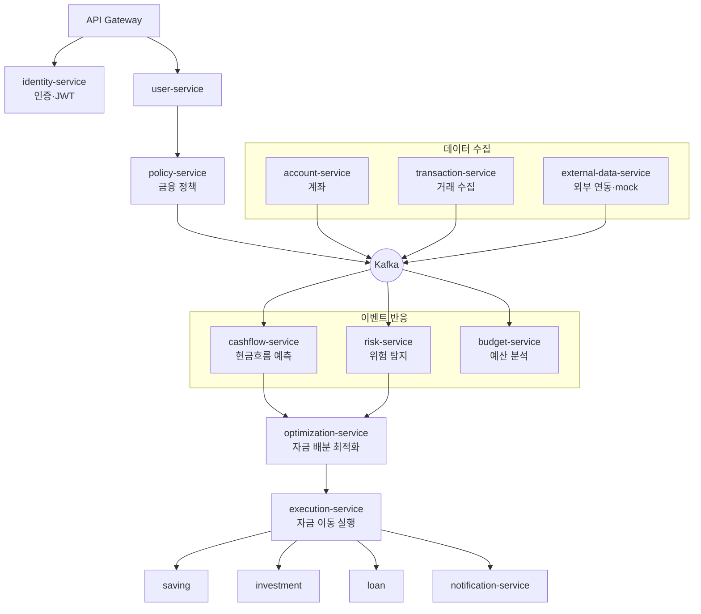
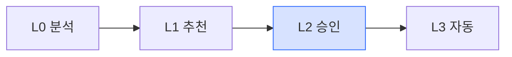
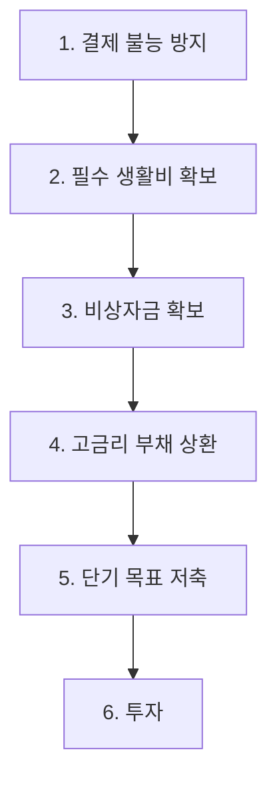

# Cath 서비스 흐름도 (Service Flow)

기획서 §10(MSA), §12(Kafka Event), §15(Demo Flow) 기준.
이 프론트엔드 데모는 아래 백엔드 흐름을 **클라이언트 순수 함수**(`src/domain/engine.ts`)로 재현한다.

## 1. 전체 아키텍처 (MSA)



## 2. 핵심 이벤트 흐름 — 돌발 지출 시나리오 (§9, §15)

사용자가 노트북을 결제하면 하나의 이벤트가 여러 도메인을 연쇄적으로 재계산시킨다.

```mermaid
sequenceDiagram
    actor U as 사용자
    participant TX as transaction-service
    participant K as Kafka
    participant CF as cashflow-service
    participant RS as risk-service
    participant OPT as optimization-service
    participant N as notification-service

    U->>TX: 노트북 결제 -₩1,290,000
    TX-->>K: PAYMENT_COMPLETED
    K-->>CF: 현금흐름 재계산
    CF-->>K: CASHFLOW_UPDATED (예상 최저잔액 하락)
    K-->>RS: 위험 재평가
    RS-->>K: LIQUIDITY_RISK_DETECTED
    K-->>OPT: 자금 재배치 계산
    OPT-->>U: 제안 (ETF 보류 + CMA→생활계좌)
    U->>OPT: 승인
    OPT->>N: 실행 완료 알림
    N-->>U: "위험이 해소되었습니다"
```

## 3. 자동화 수준 (§5) — 이 데모는 LEVEL 2 (승인 필요)



## 4. 최적화 우선순위 (§8)



> 데모 엔진(`optimize()`)은 **1·2번(결제 불능 방지 → 유동성 확보)** 만 구현한다.
> 3~6번(비상자금·부채·저축·투자 배분)은 백엔드 optimization-service 몫으로 남긴 확장 지점.
