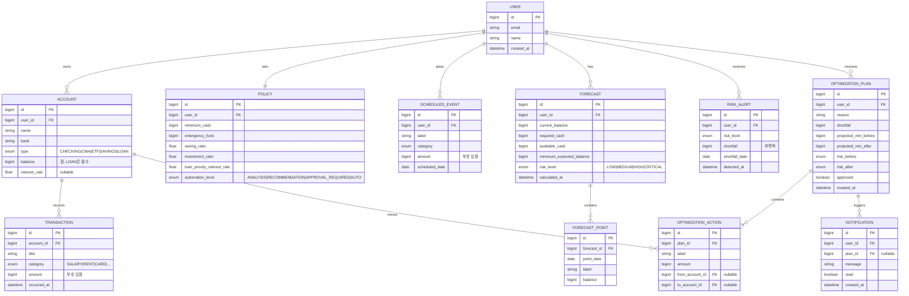

# Cath ERD

기획서 §11(Microservices)·§13(REST API) 기준의 논리 데이터 모델.
MSA에서는 서비스별로 DB가 분리되지만(§18 PostgreSQL per service), 여기서는 전체 도메인을 한 장으로 본다.
프론트 타입은 `src/domain/types.ts`와 1:1 대응한다.

## 서비스 ↔ 테이블 매핑

| Service | 소유 테이블 |
|---|---|
| `user-service` | USER |
| `account-service` | ACCOUNT |
| `transaction-service` | TRANSACTION |
| `policy-service` | POLICY, SCHEDULED_EVENT |
| `cashflow-service` | FORECAST, FORECAST_POINT |
| `risk-service` | RISK_ALERT |
| `optimization-service` | OPTIMIZATION_PLAN, OPTIMIZATION_ACTION |
| `notification-service` | NOTIFICATION |

> 데모에서는 이 전부가 `src/domain/mock.ts`의 인메모리 데이터로 대체된다.
